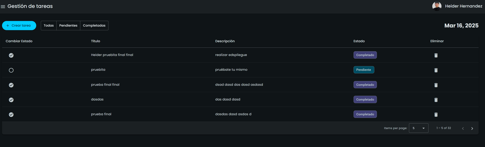

# 📋 Task Management System

Una aplicación web moderna para la gestión de tareas desarrollada con Angular 18 y .NET como prueba técnica.


## 📝 Descripción

Este proyecto es una aplicación de gestión de tareas que permite a los usuarios crear, visualizar, actualizar el estado y eliminar tareas. La aplicación cuenta con una interfaz de usuario intuitiva desarrollada con Angular 18 y Angular Material, y un backend en .NET que proporciona una API RESTful para la gestión de datos.

## ✨ Características

- 📋 Lista de tareas con paginación
- ➕ Creación de nuevas tareas
- ✅ Cambio de estado (pendiente/completado)
- 🗑️ Eliminación de tareas
- 🔍 Filtrado de tareas por estado
- 🌙 Tema personalizado (oscuro)
- 📱 Diseño responsive
- 🔄 Indicador de carga durante peticiones HTTP
- 🔔 Notificaciones (toasts) para acciones del usuario

## 🛠️ Tecnologías Utilizadas

### Frontend
- **Angular 18**: Framework de desarrollo web
- **TypeScript**: Lenguaje de programación tipado
- **Angular Material**: Biblioteca de componentes UI
- **Angular Signals**: Para manejo del estado reactivo
- **RxJS**: Para programación reactiva
- **CSS Personalizado**: Estilizado avanzado con SCSS

### Backend
- **.NET 8**: Framework para el desarrollo de la API
- **Entity Framework Core**: ORM para la manipulación de datos
- **SQL Server**: Base de datos relacional
- **RESTful API**: Para comunicación entre cliente y servidor
- **Cache en memoria**: Implementación de caché con tiempo de vida de 60 segundos
- **DTOs y Mappers**: Para transferencia segura de datos
- **Validación de modelos**: Para garantizar la integridad de los datos
- **Configuración CORS**: Para permitir la comunicación segura entre frontend y backend
- **Proveedores de configuración**: Para manejo flexible de la configuración

### Infraestructura
- **Azure**: Plataforma para el despliegue de la aplicación
  - **Azure App Service**: Para el hosting del frontend y backend
  - **Azure SQL Database**: Para el almacenamiento de datos
- **Git/GitHub**: Control de versiones y alojamiento del código

## 📂 Estructura del Proyecto

### Frontend

```
src/
├── app/
│   ├── core/                     # Componentes y servicios transversales
│   │   ├── components/           # Componentes reutilizables (spinner)
│   │   ├── interceptors/         # Interceptores HTTP (loading)
│   │   ├── models/               # Interfaces y modelos de datos comunes
│   │   ├── services/             # Servicios compartidos (loading, toast)
│   │   └── functions/            # Funciones utilitarias
│   ├── layout/                   # Componentes estructurales de la aplicación
│   ├── task/                     # Módulo de gestión de tareas
│   │   ├── components/           # Componentes específicos
│   │   │   ├── task-form/        # Formulario para crear tareas
│   │   │   └── task-list/        # Lista de tareas
│   │   ├── modal/                # Modales (confirmación de eliminación)
│   │   ├── services/             # Servicios para la gestión de tareas
│   │   │   ├── task.service.ts   # Servicio para API calls
│   │   │   └── task-store.service.ts # Store con Signals
│   │   ├── constants/            # Constantes para el módulo de tareas
│   │   └── interfaces/           # Interfaces específicas del módulo
│   ├── assets/                   # Recursos estáticos (imágenes, iconos)
│   │   └── themes/               # Definición de temas personalizados
│   └── environments/             # Configuración por entorno
└── styles.scss                   # Estilos globales
```

### Backend

```
API/
├── Controllers/                  # Controladores API REST
│   └── TaskItemsController.cs    # CRUD para tareas
├── Data/                         # Acceso a datos
│   ├── ApplicationDbContext.cs   # Contexto de Entity Framework
│   └── Repositories/             # Patrón repositorio para acceso a datos
├── DTOs/                         # Objetos de transferencia de datos
│   ├── CreateTaskItemDTO.cs      # DTO para creación de tareas
│   ├── TaskItemDTO.cs            # DTO para respuestas de tareas
│   └── UpdateTaskStatusDTO.cs    # DTO para actualización de estado
├── Mappings/                     # Perfiles de mapeo entre entidades y DTOs
├── Models/                       # Modelos de dominio
│   └── TaskItem.cs               # Entidad Task
├── Services/                     # Servicios de negocio
│   └── CacheService.cs           # Servicio de caché
└── Configuration/                # Proveedores de configuración
└── CorsConfig.cs             # Configuración de CORS
```

## 🚀 Características Implementadas

### Frontend
- **Arquitectura por Capas**: Separación clara de responsabilidades
- **Patrón Store con Signals**: Gestión del estado centralizada usando Signals de Angular
- **Interceptores HTTP**: Para mostrar indicadores de carga automáticamente
- **Responsive Design**: Adaptación a distintos tamaños de pantalla
- **Tema Personalizado**: Sistema de diseño con variables CSS
- **Manejo de Errores**: Notificaciones al usuario cuando ocurren errores
- **Validación de Formularios**: Validación en el cliente para datos de entrada
- **Paginación**: Para gestionar grandes cantidades de datos
- **Filtrado**: Filtros para visualizar tareas por estado

### Backend
- **API RESTful**: Endpoints para todas las operaciones CRUD
- **Caché en memoria**: Mejora de rendimiento con caché (TTL: 60 segundos)
- **Validación de modelos**: Anotaciones de validación en DTOs
- **Configuración CORS**: Política de seguridad para comunicación frontend-backend
- **Entity Framework Core**: Mapeo objeto-relacional para SQL Server
- **DTOs y AutoMapper**: Transferencia segura de datos y mapeo automático
- **Headers personalizados**: Para metadatos como conteo total de registros
- **Paginación en servidor**: Optimización para grandes volúmenes de datos

## 🔧 Instalación y Ejecución Local

### Requisitos Previos
- Node.js (v18 o superior)
- Angular CLI (v18)
- .NET SDK 8
- SQL Server (Local o Express)

### Pasos para Instalar

1. **Clonar el repositorio**

```
  git clone https://github.com/tu-usuario/task-management-frontend.git
  cd task-management-frontend
```

2. **Frontend (Angular)**

  ```
  npm install
  ng serve
  ```

3. **Backend**

  ```
  git clone [a este repositorio]
  usar visual studio 2022
  ```

## 🌐 Demo en Vivo

[Proyecto desplegado en AWS](https://master.d349vgtrapygbd.amplifyapp.com/tareas)
https://master.d349vgtrapygbd.amplifyapp.com/tareas


## 👨‍💻 Desarrollador
Heider Rey Hernandez
heiderhrnndz@gmail.com
@HeiderHDev
